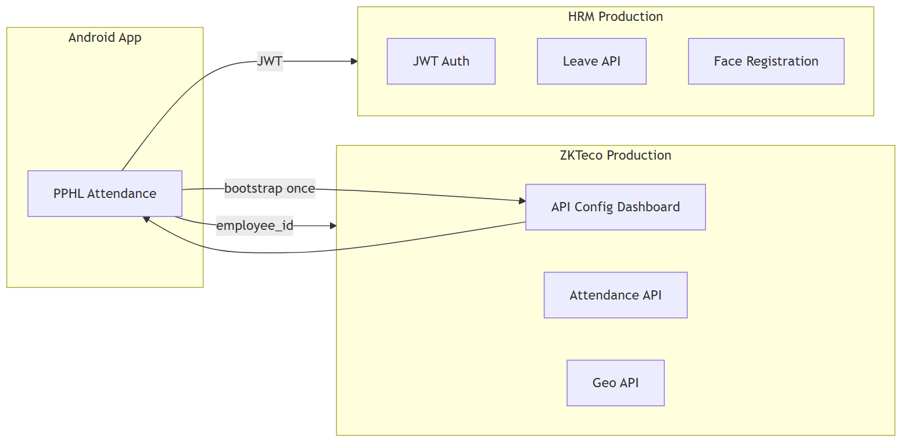
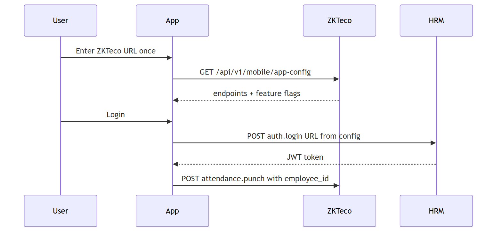
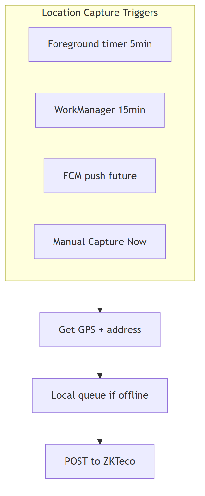
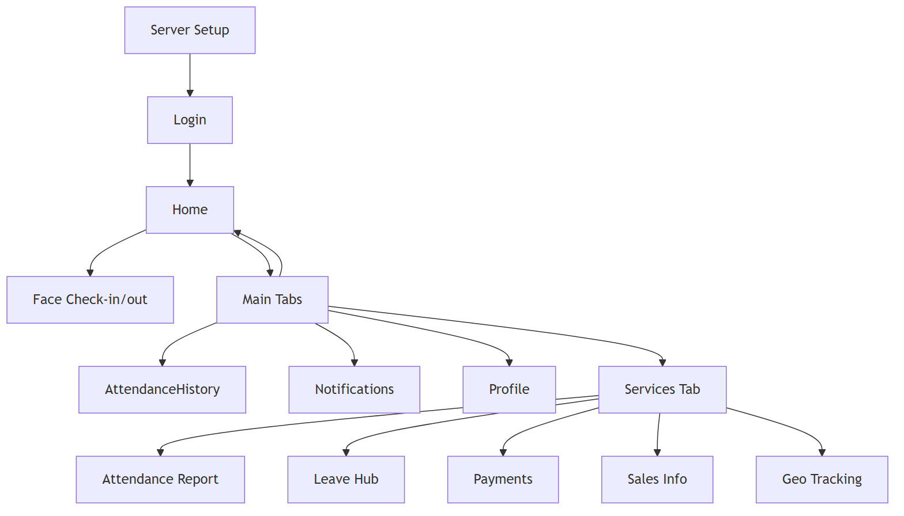

# PPHL Attendance Android App — Client Development Plan

**Document version:** 1.0  
**Date:** July 7, 2026  
**Audience:** Business stakeholders and technical teams  
**App version:** 2.1.0+ (continued development)

---

## Executive Summary

The **PPHL Attendance Android App** is a mobile employee self-service application for Peoples Paper & Packaging. It connects to two backend systems:

1. **HRM (hrm-production)** — employee login, leave, holidays, face registration, payroll-related data  
2. **ZKTeco (zkteco-production)** — attendance punches, device status, geo tracking, and **central API configuration for the mobile app**

The app is built on an **existing Flutter codebase** (not a rewrite). New work adds dashboard-driven API mapping, strict geo tracking, enhanced face attendance reporting, and placeholder Sales/Payment modules until their backends are finalized.

---

## 1. Outside Dependencies

| System | Docker stack | Local URL | Production URL | Data provided |
|--------|--------------|-----------|----------------|---------------|
| **HRM / pphl_erp** | `hrm-production` | `http://127.0.0.1:8020` | `https://hrm.peoplesitsolution.com` | Auth, profile, leave, holidays, face templates |
| **ZKTeco** | `zkteco-production` | `http://127.0.0.1:8095` | `https://zkteco.peoplesitsolution.online` | Attendance, devices, geo pings, **app config** |
| **Sales system** | TBD | — | — | Placeholder UI only |
| **Payment system** | TBD | — | — | Placeholder UI only |
| **Firebase (optional)** | — | — | — | FCM wake for geo (future) |

### Architecture diagram



*Figure 1: The app bootstraps from ZKTeco, then calls HRM (JWT) and ZKTeco (attendance/geo).*

**For business users:** The phone app talks to two company servers. HR data (leave, login) comes from the HRM server. Attendance and location data goes to the ZKTeco server. Administrators configure all API addresses from the ZKTeco web dashboard — no app update needed when URLs change.

---

## 2. Technology Stack

### Persisting from current app

| Layer | Technology |
|-------|------------|
| Framework | Flutter 3.x, Dart 3.11+ |
| HTTP | `http` package |
| Local storage | `shared_preferences` |
| Face recognition | Google ML Kit + TensorFlow Lite (MobileFaceNet) |
| Camera | `camera`, `image_picker` |
| Location | `geolocator`, `geocoding`, `permission_handler` |
| UI | `google_fonts`, `fl_chart`, `lottie`, `shimmer`, `animate_do` |
| Device ID | `android_id` |

### New additions

| Technology | Purpose |
|------------|---------|
| `workmanager` | Background geo capture (15-min OS minimum) |
| `flutter_local_notifications` | Foreground service notifications (geo) |
| Dynamic endpoint config | Fetched from ZKTeco dashboard |

### Backend technologies

| Stack | Tech |
|-------|------|
| HRM | Laravel, MySQL, JWT auth |
| ZKTeco | Laravel 13, PostgreSQL, Redis, Livewire dashboard |

---

## 3. Endpoint Mapping Feature

### How it works

1. **First launch:** User enters ZKTeco server URL once (e.g. `http://192.168.1.10:8095`)
2. **App fetches:** `GET /api/v1/mobile/app-config` (public, no login)
3. **Response includes:** Base URLs, all feature endpoints, feature flags
4. **Cached locally** and refreshed on login / app resume

### Admin configuration

**ZKTeco Dashboard → Settings → Mobile App API**

- Set HRM and ZKTeco base URLs  
- Edit each API path (login, leave, attendance punch, geo upload, etc.)  
- Toggle feature flags: Sales, Payment, Geo tracking  
- Set geo interval (default: **5 minutes**)

### Middlewareless principle

All API calls are **direct HTTP** — no extra middleware layer:

- HRM: `Authorization: Bearer <JWT>`
- ZKTeco mobile routes: `employee_id` parameter (existing pattern)

### Config flow diagram



*Figure 2: First launch downloads all API URLs from ZKTeco; login and attendance use those mapped endpoints.*

---

## 4. App Sections and Pages

### 4.1 Authentication & Setup

| Screen | Function | Technology |
|--------|----------|------------|
| **Server Bootstrap** | Enter ZKTeco URL, download config | HTTP, SharedPreferences |
| **Login** | Email/password against HRM | JWT, dynamic `auth.login` URL |

### 4.2 Home & Face Attendance

| Screen | Function | Technology |
|--------|----------|------------|
| **Home** | Dashboard, check-in/out buttons | Profile from HRM |
| **Check-in / Check-out** | Face liveness + GPS punch | ML Kit, TFLite, Geolocator, ZKTeco punch API |
| **Face Registration** | 5-angle capture, server sync | Camera, TFLite, HRM face API |

**Face attendance report enhancements:**

- Punch timeline with in/out times  
- Face verified badge per punch  
- GPS address on each record  
- Summary cards: Present, Leave, Absent, Holiday  

### 4.3 Leave Module

| Screen | Function | Backend |
|--------|----------|---------|
| Leave Hub | Balance snapshot + upcoming holidays | HRM |
| Leave Balance | Full balance list | `leave.balance` |
| Leave History | Past applications | `leave.history` |
| Apply Leave | Submit new request | `leave.apply` |

### 4.4 Geo Tracking

| Capability | Detail |
|------------|--------|
| Interval | **5 minutes** (configurable in dashboard) |
| Storage | ZKTeco `mobile_location_pings` table |
| Upload API | `POST /api/v1/mobile/geo-location` |
| Background | Foreground timer + WorkManager + FCM (planned) |
| Permissions | Foreground + background location |



*Figure 3: Location is captured on a schedule or manually, queued offline if needed, then posted to ZKTeco.*

### 4.5 Sales Info (Placeholder)

- Visible only when `feature.sales.enabled` is true **and** user is in sales employee list  
- Shows dummy metrics: Target, Orders, Revenue, Conversion  
- **Coming Soon** when feature flag is off  

### 4.6 Payment (Placeholder)

- Default: **disabled** (`feature.payment.enabled: false`)  
- Shows polished "Coming Soon" UI with sample rows  
- Live HRM loan APIs preserved behind flag for future activation  

### 4.7 Profile & Services

- **Services** footer tab (5th item) opens the employee services hub with all modules  
- Profile shows user info from HRM `get-my-info` and quick-action shortcuts  
- Settings include geo tracking toggle  

---

## 5. Navigation Map



*Figure 4: Main user journey from server setup through login, home, tabs, and employee services.*

---

## 6. Development Phases (Completed)

| Phase | Deliverable | Status |
|-------|-------------|--------|
| 1 | ZKTeco mobile API config dashboard + public API | Done |
| 2 | Geo location APIs on ZKTeco | Done |
| 3 | HRM mobile holidays + leave security + token refresh | Done |
| 4 | Android dynamic endpoint system | Done |
| 5 | Face attendance detailed report | Done |
| 6 | Geo 5-min + background worker | Done |
| 7 | Sales/Payment dummy modules | Done |

---

## 7. Local Development Setup

### Start Docker stacks

```powershell
# HRM (hrm-production)
cd hrm_deployment\docker
powershell -ExecutionPolicy Bypass -File .\scripts\up.ps1 -Build

# ZKTeco (zkteco-production)
cd zkteco_deployment\docker-bundle
docker compose --env-file .env up -d
```

### Configure endpoints

1. Open ZKTeco dashboard: `http://127.0.0.1:8095`  
2. Go to **Settings → Mobile App API**  
3. Set HRM base: `http://127.0.0.1:8020` (or LAN IP for physical device)  
4. Set ZKTeco base: `http://YOUR_LAN_IP:8095`  
5. Save and use **Preview App Config JSON**

### Physical device testing

| Target | URL |
|--------|-----|
| Emulator → host HRM | `http://10.0.2.2:8020` |
| Emulator → host ZKTeco | `http://10.0.2.2:8095` |
| Phone on same Wi-Fi | `http://PC_LAN_IP:8020` / `:8095` |

### Build APK

```powershell
cd Attandance_App
flutter pub get
flutter build apk --release
```

---

## 8. Security & Privacy

| Topic | Approach |
|-------|----------|
| Authentication | JWT on HRM; short-lived tokens with refresh endpoint |
| Attendance on ZKTeco | `employee_id` binding (existing public mobile pattern) |
| Leave data | Employees can only access own `employeeId` (server enforced) |
| Face data | Embeddings on device + encrypted template on HRM |
| Geo data | Stored in ZKTeco DB; 90-day retention (configurable) |
| API config | Public read endpoint; admin write requires dashboard login |

---

## 9. Glossary

| Term | Plain-language meaning |
|------|------------------------|
| **JWT** | Secure login token used for HRM APIs |
| **Bootstrap URL** | The one ZKTeco address entered on first app launch |
| **Endpoint mapping** | List of API addresses managed in ZKTeco dashboard |
| **Face liveness** | Checks that a real person (blink, smile) is in front of the camera |
| **hrm-production** | Docker deployment of the HRM backend |
| **zkteco-production** | Docker deployment of attendance/device backend |
| **Middlewareless** | Direct API calls without an extra processing layer |
| **Feature flag** | On/off switch for app modules (Sales, Payment, Geo) |

---

## 10. Importing to Google Docs

### Recommended: use the .docx file (diagrams embedded)

1. Upload [`CLIENT_ANDROID_APP_DEVELOPMENT_PLAN.docx`](CLIENT_ANDROID_APP_DEVELOPMENT_PLAN.docx) to Google Drive  
2. Right-click → **Open with → Google Docs**  
3. All four architecture diagrams appear as images (not code)  
4. Apply styles if needed: **Heading 1** for main sections, **Heading 2** for subsections  
5. Recommended fonts: **Open Sans** or **Arial**

### Alternative: re-import the markdown

1. Run diagram render (if PNGs are missing):
   ```powershell
   powershell -ExecutionPolicy Bypass -File .\scripts\render-client-doc-diagrams.ps1
   ```
2. Import `CLIENT_ANDROID_APP_DEVELOPMENT_PLAN.md` via Google Docs → **File → Import**  
3. If images do not appear, drag PNGs from `docs/images/client-plan/` into the document

### Regenerate exports locally

```powershell
powershell -ExecutionPolicy Bypass -File .\scripts\render-client-doc-diagrams.ps1
powershell -ExecutionPolicy Bypass -File .\scripts\export-client-doc-docx.ps1
```

Requires **Node.js** (npx) and **Pandoc** (`winget install JohnMacFarlane.Pandoc`).

---

*Prepared for PPHL / Peoples IT Solution — Attendance App Development Program*
